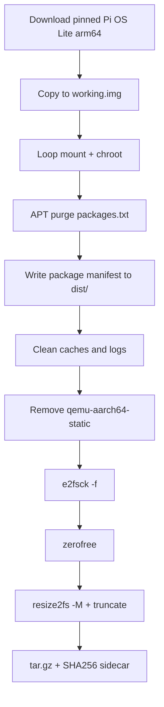

# Lancer Next Gen Raspberry Pi 5 OS Base Image Creator

This project creates a Raspberry Pi 5 OS base image suitable for the next gen software packages (NGSW).

## Architecture

The core of the project takes an upstream Raspberry Pi OS image, strips out unnecessary preinstalled packages, and repackages it for distribution as a minimal base OS image. The project is implemented as a dev container based on a Dockerfile that does all the heavy lifting. The Dockerfile is based on Debian Trixie for x86_64, matching the Raspberry Pi OS base. The container installs QEMU ARM64 user-mode emulation for performing a chroot into Trixie ARM64 sandboxes. The process of generating a clean NGSW Raspberry Pi 5 image is performed in `gen_image.sh`. The container has all the tools and utilities necessary to create the image.



## Prerequisites

- Docker with privileged container support
- Linux host, WSL2, or Dev Containers (loop mounts and binfmt require `--privileged`)
- Sufficient disk space for download (~500 MB compressed) and working image (~3 GB)

## Quick Start

1. Open the project in a Dev Container (`.devcontainer/devcontainer.json`).
2. Generate the image:

   ```bash
   ./gen_image.sh
   ```

3. Verify the artifact:

   ```bash
   ./scripts/verify_image.sh
   ```

4. Or run both:

   ```bash
   ./scripts/test.sh
   ```

Artifacts are written to `dist/`.

## Project Layout

| Path | Purpose |
|------|---------|
| `Dockerfile` | x86_64 Trixie image builder with QEMU and disk tools |
| `.devcontainer/` | Privileged dev container configuration |
| `metadata/image-defaults.env` | Pinned upstream image URL and SHA256 |
| `gen_image.sh` | Main image generation pipeline |
| `packages.txt` | APT packages to remove from upstream image |
| `scripts/lib/` | Mount, unmount, and chroot helpers |
| `scripts/verify_image.sh` | Validates generated artifacts |
| `scripts/test.sh` | Runs generation and verification |
| `.work/` | Download and working images (gitignored) |
| `dist/` | Final `.tar.gz` artifacts and package manifests (gitignored) |

## Configuration

Environment variables can be passed from the Docker host or set in `.devcontainer/docker-compose.yml`.

| Variable | Purpose | Default |
|----------|---------|---------|
| `RPI_SOURCE_IMG` | Upstream `.img` or `.img.xz` URL | Pinned in `metadata/image-defaults.env` |
| `RPI_SOURCE_IMG_SHA256` | SHA256 checksum of the downloaded file | Pinned in `metadata/image-defaults.env` |
| `WORK_DIR` / `CACHE_DIR` | Cached upstream download (`.img.xz`) | `/workspace/.work` |
| `PROCESSING_DIR` | Working image processing (container-local) | `/tmp/ddm-processing` |
| `DIST_DIR` | Final artifacts | `/workspace/dist` |
| `PADDING_SECTORS` | Extra sectors after last used block when truncating | `8192` (~4 MiB) |

### Checksum validation

- If `RPI_SOURCE_IMG_SHA256` is set, the downloaded file is validated against it.
- If `RPI_SOURCE_IMG_SHA256` is absent but `RPI_SOURCE_IMG` is present, checksum validation is skipped.
- If neither is provided, defaults from `metadata/image-defaults.env` are used (URL + SHA256).

## packages.txt

This file contains the list of packages that should be removed from the upstream image. Format:

- One APT package name per line
- Lines starting with `#` and blank lines are ignored
- Packages are removed with `apt-get purge -y` inside the chroot
- Packages not installed on the upstream image are skipped
- Notable removals beyond the build toolchain include `binutils-aarch64-linux-gnu`, `python3.13`, and `perl`

## gen_image.sh

This shell script is responsible for generating the image. The order of operations:

1. Download a Raspberry Pi OS image from `RPI_SOURCE_IMG` if set, otherwise use pinned defaults.
2. Validate the download against `RPI_SOURCE_IMG_SHA256` when a checksum is configured.
3. Copy the source to a working image so a failed run can reuse the download.
4. Mount the ARM64 working image, prepare bind mounts, and copy in QEMU user-static for chroot.
5. Chroot into the image and purge packages listed in `packages.txt`.
6. Write a sorted package manifest to `dist/<release>-ngsw-minimal.packages.txt` on the host (not inside the image).
7. Minimize the base image by removing temporary files, APT caches, and truncating all regular files under `/var/log` (recursively).
8. Remove the injected `qemu-aarch64-static` binary from the image filesystem.
9. Run `e2fsck -f` on the root filesystem.
10. Zero free space with `zerofree` on the unmounted root partition.
11. Unmount filesystems and detach the loop device.
12. Shrink the root filesystem with `resize2fs -M` and truncate the image file to the last used sector plus padding.
13. Rename the image to indicate it has been minimized, then tar and gzip it into `dist/` with a `.sha256` sidecar.

## Outputs

| Artifact | Location |
|----------|----------|
| Working copy | `/tmp/ddm-processing/working.img` (during build) |
| Cached download | `.work/<upstream>.img.xz` |
| Final image | `/tmp/ddm-processing/<release>-ngsw-minimal.img` |
| Distribution archive | `dist/<release>-ngsw-minimal.img.tar.gz` |
| Checksum sidecar | `dist/<release>-ngsw-minimal.img.tar.gz.sha256` |
| Installed package manifest | `dist/<release>-ngsw-minimal.packages.txt` |

## Manual Docker Usage

```bash
docker build -t ddm-image-builder .
docker run --rm -it --privileged \
  -v "${PWD}:/workspace" \
  ddm-image-builder \
  bash /workspace/scripts/test.sh
```

## Downstream Note

The `nextgen` provisioning server currently declares `DEBIAN_DISTRO: bookworm` for Raspberry Pi targets. This project intentionally produces **Trixie**-based images aligned with current Raspberry Pi OS releases. Update `nextgen` cloud-init metadata when Trixie images are adopted for production provisioning.

## CI

GitHub Actions workflow `.github/workflows/ci.yml` builds the container and runs `scripts/test.sh` in a privileged Docker runner on push and pull request.
