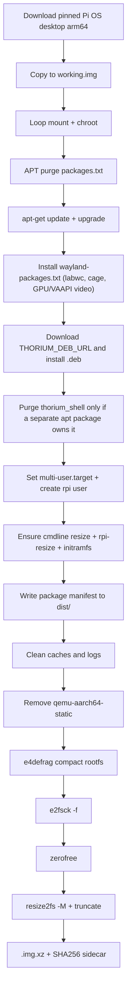

# Lancer Next Gen Raspberry Pi 5 OS Base Image Creator

This project creates a Raspberry Pi 5 OS base image suitable for the next gen software packages (NGSW).

## Architecture

The core of the project takes an upstream Raspberry Pi OS **desktop** arm64 image, strips the Pi Desktop shell and preinstalled apps, keeps a Wayland/GPU/VAAPI stack for high-performance video, installs **cage** and **Thorium**, and repackages the result as a minimal kiosk-oriented base OS image. The project is implemented as a dev container based on a Dockerfile that does all the heavy lifting. The Dockerfile is based on Debian Trixie for x86_64, matching the Raspberry Pi OS base. The container installs QEMU ARM64 user-mode emulation for performing a chroot into Trixie ARM64 sandboxes. The process of generating a clean NGSW Raspberry Pi 5 image is performed in `gen_image.sh`. The container has all the tools and utilities necessary to create the image.



## Prerequisites

- Docker with privileged container support
- Linux host, WSL2, or Dev Containers (loop mounts and binfmt require `--privileged`)
- Sufficient disk space for download (~1.3 GB compressed desktop image, plus Thorium `.deb`) and working image (~6 GB+)

## Quick Start

1. Open the project in a Dev Container (`.devcontainer/devcontainer.json`).
2. Generate the image:

   ```bash
   ./gen_image.sh
   ```

3. Verify the artifact:

   ```bash
   ./scripts/verify_image.sh
   ```

4. Or run both:

   ```bash
   ./scripts/test.sh
   ```

Artifacts are written to `dist/`.

## Project Layout

| Path | Purpose |
|------|---------|
| `Dockerfile` | x86_64 Trixie image builder with QEMU and disk tools |
| `.devcontainer/` | Privileged dev container configuration |
| `metadata/image-defaults.env` | Pinned upstream image URL, SHA256, and Thorium `.deb` URL |
| `gen_image.sh` | Main image generation pipeline |
| `packages.txt` | APT packages to remove from upstream image |
| `wayland-packages.txt` | APT packages to keep/install for Wayland kiosk + GPU/VAAPI |
| `scripts/lib/` | Mount, unmount, and chroot helpers |
| `scripts/verify_image.sh` | Validates generated artifacts |
| `scripts/test.sh` | Runs generation and verification |
| `.work/` | Download and working images (gitignored) |
| `dist/` | Final `.img.xz` artifacts, checksums, and package manifests (gitignored) |

## Configuration

Environment variables can be passed from the Docker host or set in `.devcontainer/docker-compose.yml`.

| Variable | Purpose | Default |
|----------|---------|---------|
| `RPI_SOURCE_IMG` | Upstream `.img` or `.img.xz` URL | Pinned in `metadata/image-defaults.env` |
| `RPI_SOURCE_IMG_SHA256` | SHA256 checksum of the downloaded file | Pinned in `metadata/image-defaults.env` |
| `THORIUM_DEB_URL` | Direct URL to Thorium arm64 `.deb` | Thorium-Raspi `M138.0.7204.303` asset in `image-defaults.env` |
| `THORIUM_DEB_SHA256` | Optional SHA256 of the Thorium `.deb` | unset (skip validation) |
| `WORK_DIR` / `CACHE_DIR` | Cached upstream download (`.img.xz`, Thorium `.deb`) | `/workspace/.work` |
| `PROCESSING_DIR` | Working image processing (container-local) | `/tmp/ddm-processing` |
| `DIST_DIR` | Final artifacts | `/workspace/dist` |
| `PADDING_SECTORS` | Extra sectors after last used block when truncating | `8192` (~4 MiB) |

### Checksum validation

- If `RPI_SOURCE_IMG_SHA256` is set, the downloaded file is validated against it.
- If `RPI_SOURCE_IMG_SHA256` is absent but `RPI_SOURCE_IMG` is present, checksum validation is skipped.
- If neither is provided, defaults from `metadata/image-defaults.env` are used (URL + SHA256).
- `THORIUM_DEB_SHA256` follows the same optional validation pattern for the Thorium `.deb`.

## packages.txt

This file contains the list of packages that should be removed from the upstream image. Format:

- One APT package name per line
- Lines starting with `#` and blank lines are ignored
- Packages are removed with `apt-get purge -y` inside the chroot
- Packages not installed on the upstream image are skipped
- Includes Pi Desktop shell metas (`rpd-*`), panels/plugins, LightDM, and preinstalled apps (Chromium, Firefox, VLC, etc.)
- Also strips networking userland (OpenSSH, Wi‑Fi, Bluetooth stack/apps, avahi, nfs, …) while keeping `dhcpcd-base`, `iproute2`, and `netbase`
- Also strips cron (`cron`, `cron-daemon-common`) and extra fonts (`fonts-freefont-ttf`, `fonts-urw-base35`, …); keeps `fonts-dejavu-core` / `fonts-dejavu-mono` / `fonts-liberation` via `wayland-packages.txt`
- Also strips the generic 64-bit kernel (`linux-image-rpi-v8` / `linux-base-rpi-v8`); keeps the Pi 5 kernel (`linux-image-rpi-2712`) via `wayland-packages.txt`
- Also strips desktop residue left after `rpd-*` removal (gvfs, evince, PolicyKit chrome, icon themes, etc.)
- Also strips Python minimal runtime (`python3.13-minimal`, …); leaves Debian essential `perl-base`
- Also strips PipeWire audio daemons; the image is video-decode oriented. Intentional keep-backs (not purge failures): `alsa-utils` and `dconf-cli` (Depends of `raspi-config` via `raspberrypi-sys-mods`), `libldacbt-enc2` (Depends of `gstreamer1.0-plugins-bad`), `fonts-liberation` (Depends of Thorium), `fonts-dejavu-mono` (Depends of `fonts-dejavu-core`)
- Also strips unused Atheros Wi‑Fi firmware (`firmware-atheros`); keeps other firmware needed for Pi hardware / kiosk video
- Does **not** purge GPU/VAAPI/V4L/libav or Pi-relevant firmware stacks (`raspi-firmware`, `firmware-brcm80211`, …)
- Wi‑Fi, SSH, audio daemons, and cron must be reinstalled by downstream provisioning if needed
- If a purged package is required again by Wayland/cage/Thorium (or as a hard dep of kept video packages), move it to `wayland-packages.txt` with a comment naming that source and remove it from `packages.txt`

## wayland-packages.txt

Packages reinstalled after purge so the kiosk Wayland base survives `autoremove`:

- Compositors: `labwc`, `cage`, `xwayland`, `libwlroots-0.19`
- Wayland/GPU/VAAPI anchors and video decode stacks (`ffmpeg`, gstreamer plugins; includes `libldacbt-enc2`)
- Fonts: `fonts-dejavu-core`, `fonts-dejavu-mono`, `fonts-liberation` (Thorium)
- Pi 5 kernel meta (`linux-image-rpi-2712`, `linux-base-rpi-2712`)
- First-boot rootfs expand: `raspberrypi-sys-mods` (initramfs `resize_early` + `rpi-resize.service`; hard-deps `raspi-config`, which pulls `alsa-utils` and `dconf-cli`)
- Annotated keep section for packages that must remain because Thorium, labwc/cage, raspi-config, or the video stack hard-depends on them after purge

## gen_image.sh

This shell script is responsible for generating the image. The order of operations:

1. Download a Raspberry Pi OS image from `RPI_SOURCE_IMG` if set, otherwise use pinned defaults.
2. Validate the download against `RPI_SOURCE_IMG_SHA256` when a checksum is configured.
3. Copy the source to a working image so a failed run can reuse the download.
4. Mount the ARM64 working image, prepare bind mounts, and copy in QEMU user-static for chroot.
5. Chroot into the image and purge packages listed in `packages.txt` (before upgrade, to free space and avoid downloading upgrades for packages that will be removed).
6. Chroot into the image and run `apt-get update` + `apt-get upgrade -y` to bring remaining packages to the latest versions.
7. Chroot and install packages from `wayland-packages.txt` (`labwc`, `cage`, GPU/VAAPI keep list).
8. Download the Thorium arm64 `.deb` from `THORIUM_DEB_URL` (cached under `.work/`) and install it in the chroot.
9. If `thorium_shell` is owned by a dedicated apt package (not `thorium-browser`), purge that package; otherwise leave it (never delete package files by hand).
10. Configure console boot: set systemd `default.target` to `multi-user.target`, remove leftover LightDM/`piwiz` first-boot wiring, and create login user `rpi` (password `rpi`, sudo group).
11. Ensure first-boot rootfs resize: `resize` in `cmdline.txt`, `rpi-resize.service` enabled, and `update-initramfs -u` so `resize_early` is in the initrd.
12. Write a sorted package manifest to `dist/<release>-ngsw-minimal.packages.txt` on the host (not inside the image).
13. Minimize the base image by removing temporary files, APT caches, and truncating all regular files under `/var/log` (recursively).
14. Remove the injected `qemu-aarch64-static` binary from the image filesystem.
15. Defragment the mounted rootfs with `e4defrag` so used blocks are compacted before shrink.
16. Unmount filesystems, run `e2fsck -f`, and zero free space with `zerofree` on the unmounted root partition.
17. Detach the loop device.
18. Shrink the root filesystem with `resize2fs -M` and truncate the image file to the last used sector plus padding.
19. Rename the image to indicate it has been minimized, compress it with `xz` into `dist/` as `.img.xz`, and write a `.sha256` sidecar for the compressed artifact.

## Outputs

| Artifact | Location |
|----------|----------|
| Working copy | `/tmp/ddm-processing/working.img` (during build) |
| Cached download | `.work/<upstream>.img.xz` |
| Cached Thorium `.deb` | `.work/thorium-browser_*.deb` |
| Distribution image | `dist/<release>-ngsw-minimal.img.xz` |
| Checksum sidecar | `dist/<release>-ngsw-minimal.img.xz.sha256` |
| Installed package manifest | `dist/<release>-ngsw-minimal.packages.txt` |

## Manual Docker Usage

```bash
docker build -t ddm-image-builder .
docker run --rm -it --privileged \
  -v "${PWD}:/workspace" \
  ddm-image-builder \
  bash /workspace/scripts/test.sh
```

## Downstream Note

The `nextgen` provisioning server currently declares `DEBIAN_DISTRO: bookworm` for Raspberry Pi targets. This project intentionally produces **Trixie**-based images aligned with current Raspberry Pi OS releases. Update `nextgen` cloud-init metadata when Trixie images are adopted for production provisioning.

The image boots to **multi-user.target** (console), not `graphical.target`. The upstream desktop first-boot GUI wizard (`piwiz` / LightDM) is intentionally absent. Default console login is on **tty1** as **`rpi` / `rpi`** with sudo (`getty@tty1` is statically enabled); other VTs also work via logind. Change this password after first login in production. OpenSSH is not included in the base image—reinstall it via downstream provisioning if needed.

On first boot, the root partition and filesystem expand to fill the drive via the Trixie `raspberrypi-sys-mods` path: the `resize` token in `/boot/firmware/cmdline.txt` grows the partition in initramfs (`resize_early`), then `rpi-resize.service` runs `systemd-growfs-root` when `/etc/machine-id` is still uninitialized. The build shrinks the image for distribution; first boot grows it back out.

Kiosk systemd units, auto-login, and Thorium/cage CLI flags are expected to be configured by the consuming project. Wayland (`labwc` / `cage`) and Thorium remain installed for that purpose.

## CI

GitHub Actions workflow `.github/workflows/ci.yml` builds the container and runs `scripts/test.sh` in a privileged Docker runner on push and pull request. On success it publishes the `dist/` outputs (`.img.xz`, `.sha256`, and `.packages.txt`) as the `ngsw-minimal-image` workflow artifact (14-day retention).
